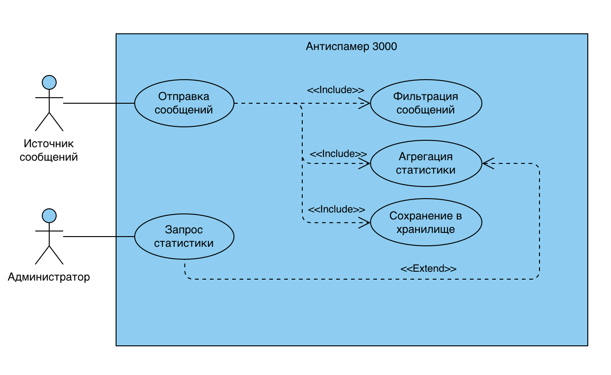
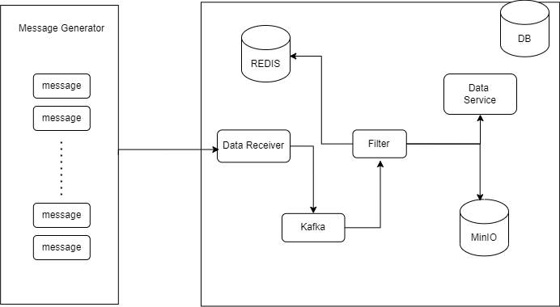

# Антиспамер 3000

Антиспамер 3000 — боевая система анализа и фильтрации мусорных сообщений.

## Что делает
Сервис получает поток сообщений с разных источников, анализирует их по простым признакам (длина, частота символов, ключевые слова), присваивает тег, и отправляет результат в другие сервисы через брокер.

## Формирование требований

### 1. Нагрузка и масштабируемость

- Поток сообщений: от 1000 до 10 000 сообщений в секунду.
- Пиковая нагрузка: до 50 000 сообщений/сек при стресс-тестах.
- Объём обрабатываемых данных: десятки миллионов сообщений в сутки.
- Горизонтальная масштабируемость: возможность масштабировать каждый компонент независимо.

### 2. Объём хранимых данных

- Один JSON-сообщение: ~300 байт.
- Объём за день (при 10k msg/sec):  
  10,000 × 300 Б × 86,400 сек = ~250 ГБ в сутки.
- Хранение логов фильтрации:  
  1 неделя — ~1.75 ТБ.

---

## Use-case

---

## Компоненты проекта

1. Message Generator
   - Сценарии генерации:
      - валидные сообщения,
      - шаблонный спам,
      - "мусор" из случайных символов.

2. Data Receiver
   - Принимает входящий поток.
   - Отправляет сообщения в Kafka.

3. Kafka
   - Асинхронная передача между компонентами.
   - Поддержка очередей, ретраев, масштабируемость.

4. Filter Service
   - Применяет эвристики:
      - длина строки,
      - повторяющиеся символы (например, "аааааа"),
      - ключевые слова.
   - Присваивает тег.
   - Отправляет в MongoDB, Redis, Aggregation Service.
   - Чтение и обновление Redis.

5. Aggregation Service
   - Сбор статистики:
      - количество спама за минуту,
      - топ-5 подозрительных источников.

6. Redis
   - Быстрый доступ к агрегированной информации.
   - TTL для хранения только актуальных метрик (например, за последние 10 минут).

7. MongoDB
   - Историческое хранилище всех сообщений и их тегов.
   - Возможность построения отчётов, выборок и повторного анализа.

8. Minio
   - Архивация спама.

---

