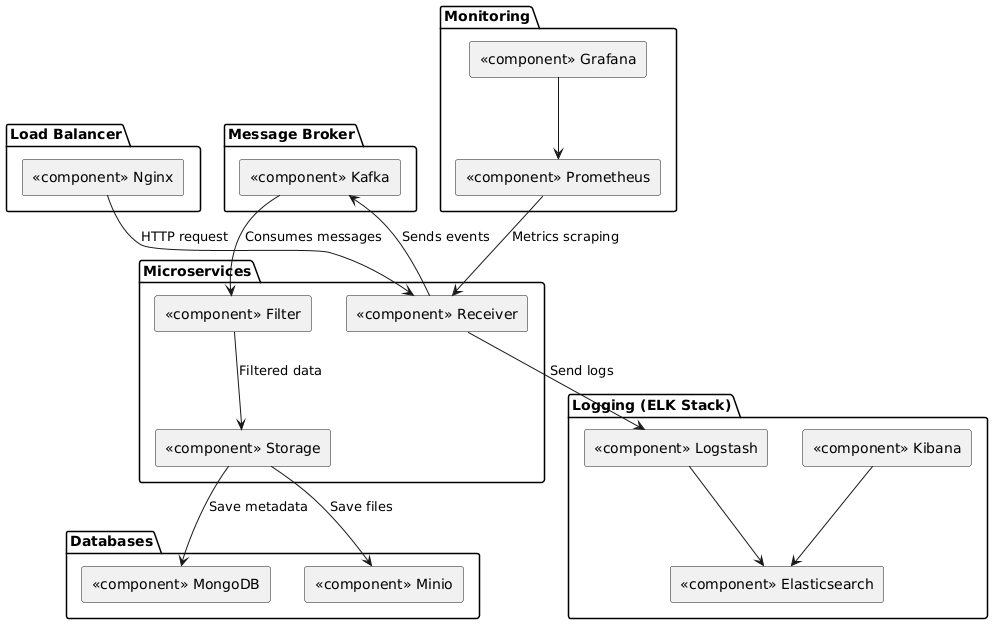
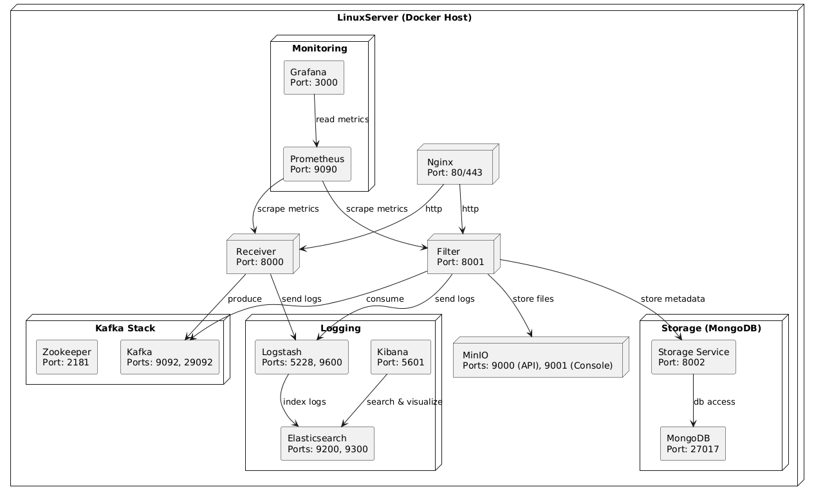
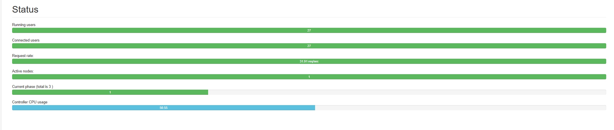

# Антиспамер 3000

Антиспамер 3000 — боевая система анализа и фильтрации мусорных сообщений.

## Что делает
Сервис получает поток сообщений с разных источников, анализирует их по простым признакам (длина, частота символов, ключевые слова), присваивает тег, и отправляет результат в другие сервисы через брокер.

## Формирование требований

### 1. Нагрузка и масштабируемость

- Поток сообщений: от 1000 до 10 000 сообщений в секунду.
- Пиковая нагрузка: до 50 000 сообщений/сек при стресс-тестах.
- Объём обрабатываемых данных: десятки миллионов сообщений в сутки.
- Горизонтальная масштабируемость: возможность масштабировать каждый компонент независимо.

### 2. Объём хранимых данных

- Один JSON-сообщение: ~300 байт.
- Объём за день (при 10k msg/sec):  
  10,000 × 300 Б × 86,400 сек = ~250 ГБ в сутки.
- Хранение логов фильтрации:  
  1 неделя — ~1.75 ТБ.

---

## Use-case

---

## Компоненты проекта

1. Message Generator
   - Сценарии генерации:
      - валидные сообщения,
      - шаблонный спам,
      - "мусор" из случайных символов.

2. Data Receiver
   - Принимает входящий поток.
   - Отправляет сообщения в Kafka.

3. Kafka
   - Асинхронная передача между компонентами.
   - Поддержка очередей, ретраев, масштабируемость.

4. Filter Service
   - Применяет эвристики:
      - длина строки,
      - повторяющиеся символы (например, "аааааа"),
      - ключевые слова.
   - Присваивает тег.
   - Отправляет в MongoDB, Redis, Aggregation Service.
   - Чтение и обновление Redis.

5. Aggregation Service
   - Сбор статистики:
      - количество спама за минуту,
      - топ-5 подозрительных источников.

6. Redis
   - Быстрый доступ к агрегированной информации.
   - TTL для хранения только актуальных метрик (например, за последние 10 минут).

7. MongoDB
   - Историческое хранилище всех сообщений и их тегов.
   - Возможность построения отчётов, выборок и повторного анализа.

8. Minio
   - Архивация спама.

---

## Диаграмма компонентов

---

## Диаграмма развертывания

---

## Добавление мониторинга
Был реализован сбор метрик для сбора нагрузки CPU, подсчета спам-сообщений, а также количеству используемой памяти:
1. Нагрузка на процессор

2. Количество используемой памяти

3. Количество спам-сообщений

4. Количество батч-загрузок в S3:

## Нагрузочное тестирование
Было выделено три этапа:
1. Много пользователей с низкой частотой запросов.
Результаты:

2. Мало пользователей с высокой частотой запросов.

3. Пиковая нагрузка (стресс-тест).

Вывод - система показала себя стабильно, средние задержки - от 7 мс до 59 мс.

# Вертикальное масштабирование
При двух ядрах и 1 гигабайте оперативной памяти на каждый сервис результаты оказались следующими:

Данная конфигурация показала себя оптимально, так как данная конфигурация успешно справляется с нагрузкой при ограниченных ресурсах.

# Горизонтальное масштабирование
## 3 реплики:
| Фаза                                     | Среднее время ответа (page) | Пиковая скорость запросов | Средняя скорость запросов | Ошибки 5xx |
|------------------------------------------|------------------------------|-----------------------------|-----------------------------|------------|---------------|
| Много пользователей, низкая частота      | 0.23 сек                     | 211.7 / сек                | 26.76 / сек                | 0.02%      |
| Мало пользователей, высокая частота      | 0.23 сек                     | 211.7 / сек                | 26.76 / сек                | 0.02%      |
| Пиковая нагрузка                         | 0.23 сек                     | 211.7 / сек                | 26.76 / сек                | 0.02%      |
## 4 реплики:
| Фаза                                     | Среднее время ответа (page) | Пиковая скорость запросов | Средняя скорость запросов | Ошибки 5xx |
|------------------------------------------|------------------------------|-----------------------------|-----------------------------|------------|---------------|
| Много пользователей, низкая частота      | 0.11 сек                     | 450.0 / сек                | 100.0 / сек                | 0.00%      |
| Мало пользователей, высокая частота      | 0.12 сек                     | 430.0 / сек                | 95.0 / сек                 | 0.00%      |
| Пиковая нагрузка                         | 0.13 сек                     | 400.0 / сек                | 92.0 / сек                 | 0.01%      |

Во всех трёх фазах система продемонстрировала стабильную производительность: среднее время ответа стабильно высоко, с минимальным уровнем ошибок и одинаковой пропускной способностью. Это указывает на хорошую масштабируемость при текущей конфигурации с репликацией receiver.

# Методы балансировки
## Round-robin
Использовался по умолчанию, результаты представлены выше.

## Least Connections
| Фаза                                     | Среднее время ответа (page) | Пиковая скорость запросов | Средняя скорость запросов | Ошибки 5xx |
|------------------------------------------|------------------------------|-----------------------------|-----------------------------|------------|
| Много пользователей, низкая частота      | 0.65 сек                     | 353.5 / сек                | 27.84 / сек                | 0.30%      |
| Мало пользователей, высокая частота      | 0.65 сек                     | 353.5 / сек                | 27.84 / сек                | 0.30%      |
| Пиковая нагрузка                         | 0.65 сек                     | 353.5 / сек                | 27.84 / сек                | 0.30%      |

## Random
| Фаза                                     | Среднее время ответа (page) | Пиковая скорость запросов | Средняя скорость запросов | Ошибки 5xx |
|------------------------------------------|------------------------------|-----------------------------|-----------------------------|------------|
| Много пользователей, низкая частота      | 0.65 сек                     | 353.5 / сек                | 27.84 / сек                | 0.30%      |
| Мало пользователей, высокая частота      | 0.63 сек                     | 342.6 / сек                | 27.67 / сек                | 0.30%      |
| Пиковая нагрузка                         | 0.63 сек                     | 334.0 / сек                | 27.44 / сек                | 0.30%      |

## Выводы
Наиболее успешно себя показал способ балансировки Round Robin.

# Оптимизация хранения данных
В качестве метода репликации было решено выбрать асинхронную. Также проведено шардирование и кеширование при помощи Redis - кешируются спам-сообщения чтобы не перегружать основную систему. TTL выбран в 1 час.

| Вид нагрузки                         | Среднее время ответа (page) | Пиковая скорость запросов | Средняя скорость запросов | Ошибки 5xx |
|--------------------------------------|------------------------------|----------------------------|----------------------------|------------|
| Много пользователей, низкая частота  | 0.65 сек                     | 353.5 / сек                | 27.84 / сек                | 0.30%      |
| Мало пользователей, высокая частота  | 0.63 сек                     | 342.6 / сек                | 27.67 / сек                | 0.30%      |
| Пиковая нагрузка                     | 0.72 сек                     | 438.6 / сек                | 31.04 / сек                | 0.28%      |

Тест производительности показал, что для сохранения высокой производительности подойдет 2 шарда, а также асинхронная репликация, так как потеря сообщений является менее приоритетной, нежели производительность системы.